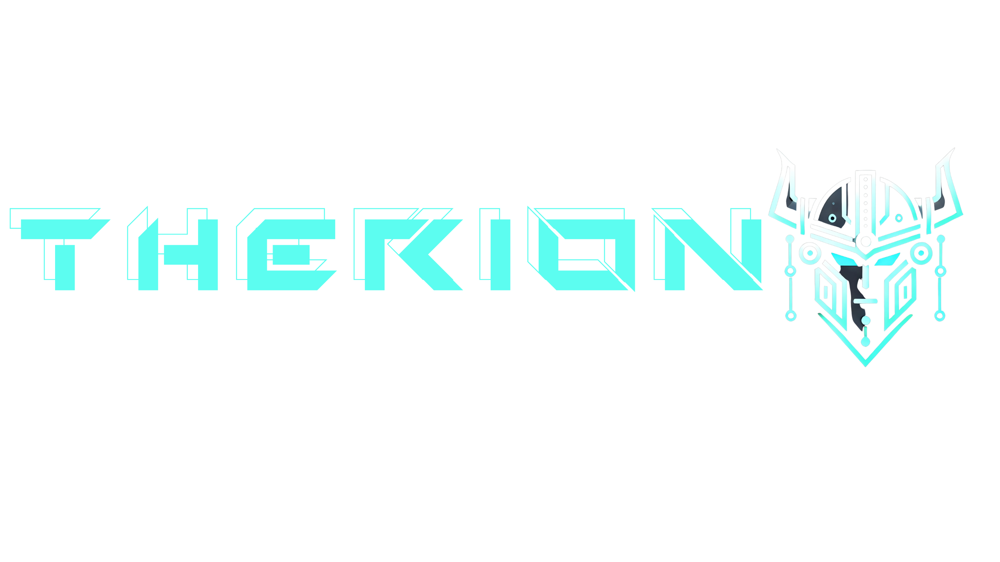

# Projeect Therion AI



---

## Description
This project involves the creation of a **Crypto-Related AI Bot**. It serves as part of an innovative and engaging **Crypto AI Project**. The bot focuses on providing unique AI capabilities tailored to cryptocurrency enthusiasts, traders, and the crypto-curious audience.

---

## Features
- **AI Integration:** Enhance user interaction and analysis through artificial intelligence.
- **Crypto-Centric Design:** Built to focus on cryptocurrency markets, tools, and insights.
- **User-Friendly UI/UX:** Ensuring seamless navigation and interaction for users.

---

## Assets
### Project Logo


### Twitter Header


---

## Installation
To run this project locally, follow these steps:

1. **Clone the Repository**
   ```bash
   git clone https://github.com/your-username/crypto-ai-bot.git
   ```

2. **Navigate to the Project Directory**
   ```bash
   cd crypto-ai-bot
   ```

3. **Install Dependencies**
   Ensure you have Python or Node.js (depending on the bot's framework) installed, then:
   ```bash
   npm install   # For Node.js projects
   pip install -r requirements.txt  # For Python projects
   ```

4. **Run the Application**
   Start the AI bot with:
   ```bash
   npm start   # For Node.js projects
   python app.py  # For Python projects
   ```

---

## Usage
1. Open the bot interface (CLI/GUI/Chat Window).
2. Start interacting with the AI bot for crypto-related insights, analytics, or tasks.
3. Customize settings and explore additional features!

---

## Contributing
Contributions are welcome! If you'd like to improve or add features:
1. Fork the repository.
2. Create a new branch (`feature-branch-name`).
3. Commit and push your changes.
4. Submit a pull request.

---

## License
This project is licensed under the **MIT License**. See `LICENSE` for more information.

---

## Social Media
Follow us on Twitter for updates:


---

## Contact
For any queries, reach out to the team via [your-email@example.com](mailto:your-email@example.com).

---

**Created with ❤️ for the Crypto AI Community**.
